# AplyEase - Flow Diagrams

## 🔄 **Application Workflow**

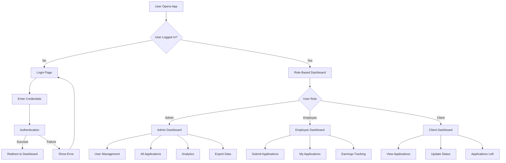

## 🔐 **Authentication Flow**

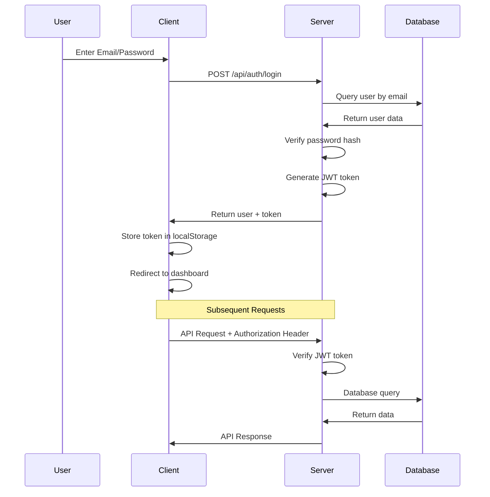

## 📝 **Application Submission Flow**

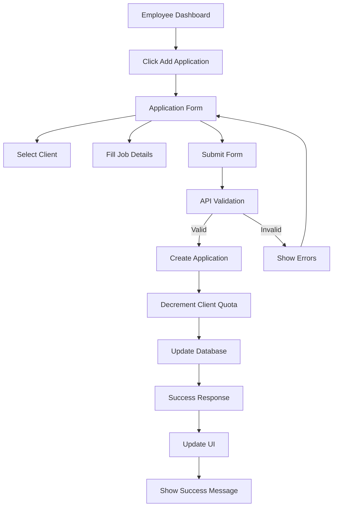

## 👥 **User Management Flow (Admin)**

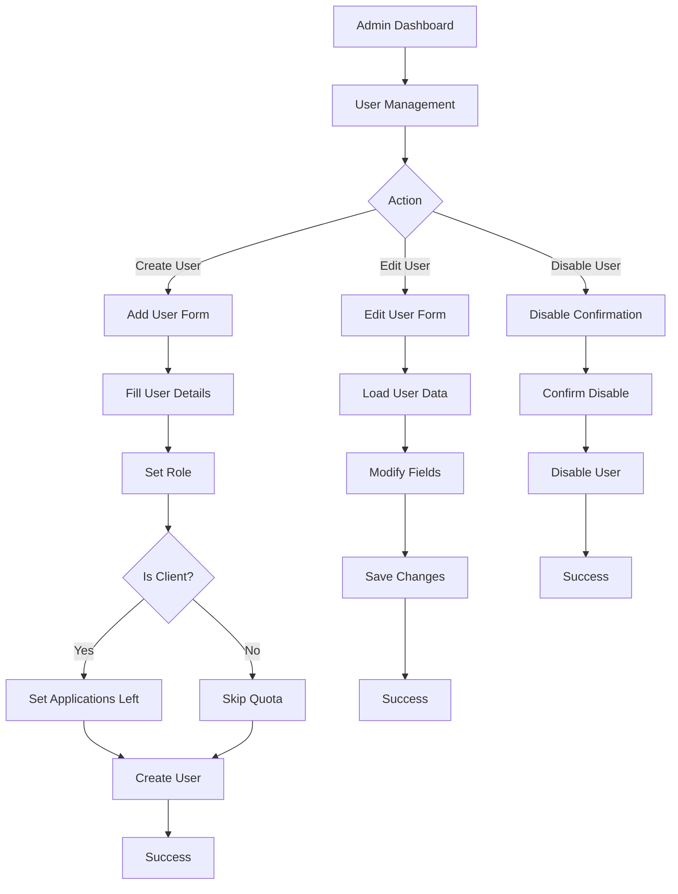

## 📊 **Dashboard Data Flow**

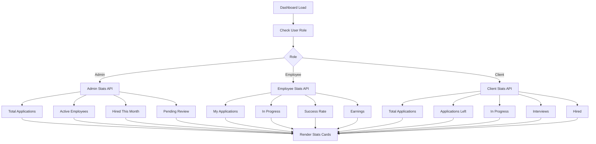

## 🔄 **Application Status Update Flow**

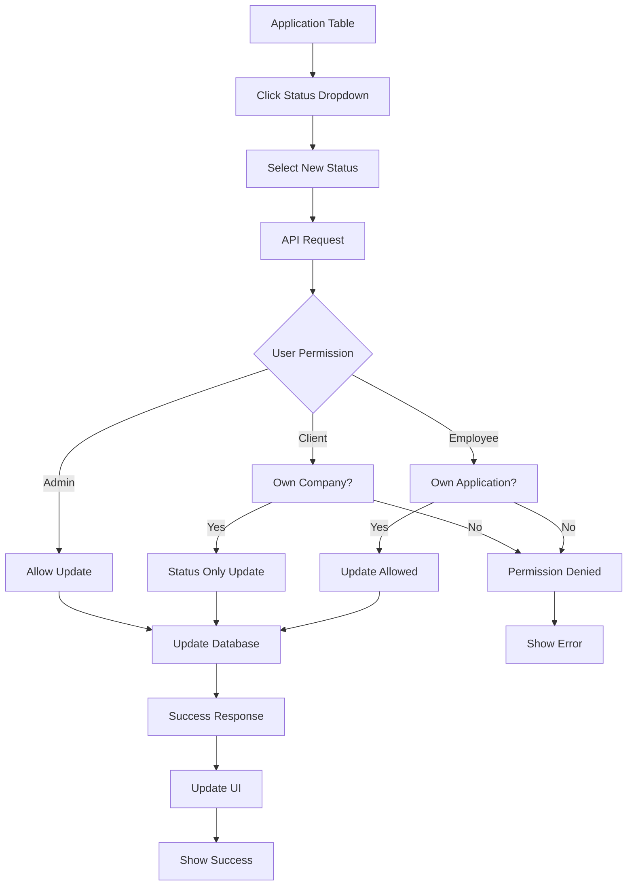

## 📈 **Earnings Calculation Flow**

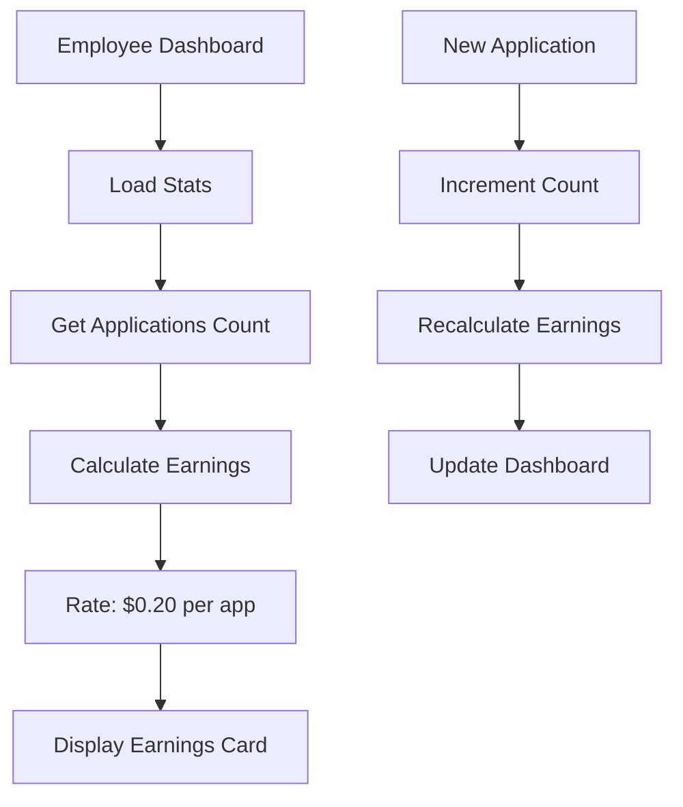

## 🎯 **Applications Left Tracking Flow**

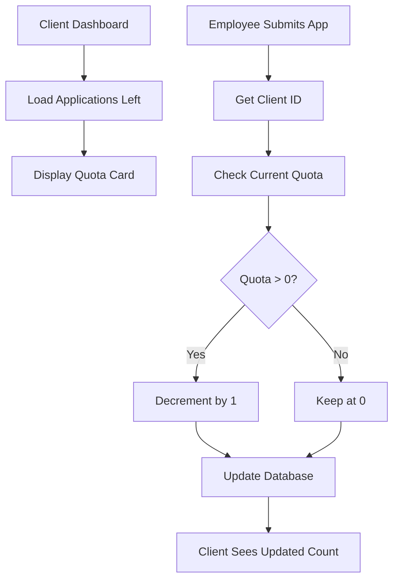

## 🔒 **Role-Based Access Control Flow**

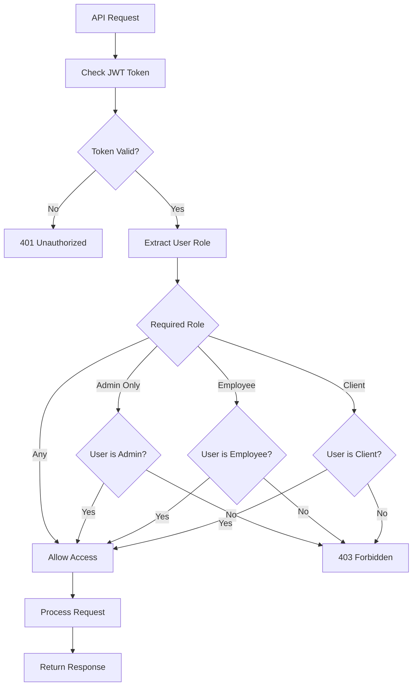

## 📤 **Data Export Flow**

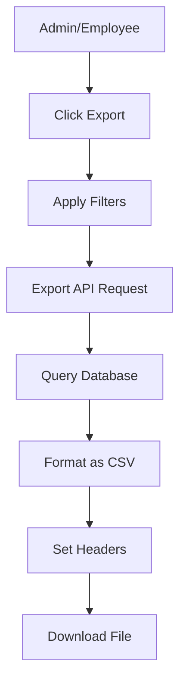

## 🏗️ **System Architecture Flow**

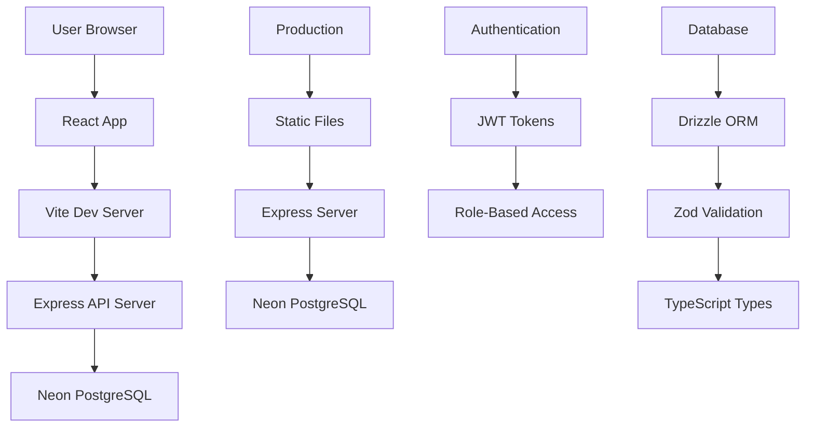

## 🚀 **Deployment Flow**

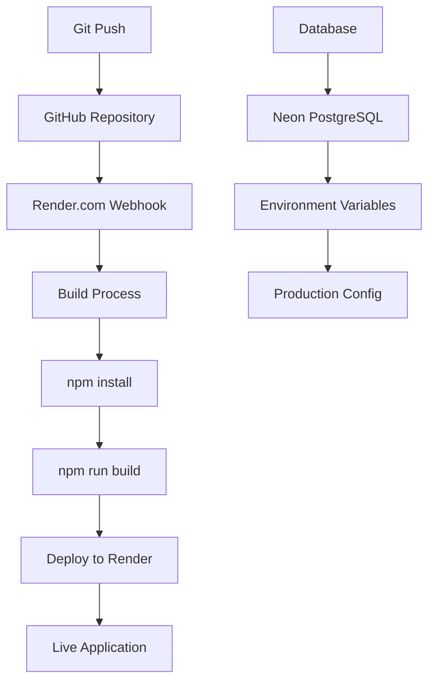
