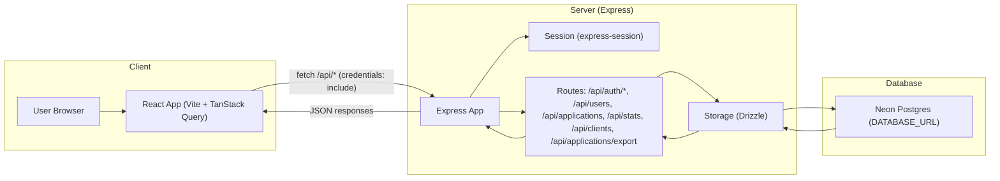
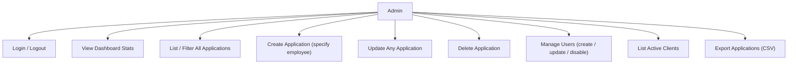
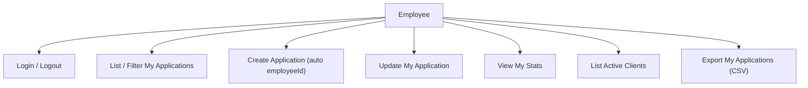
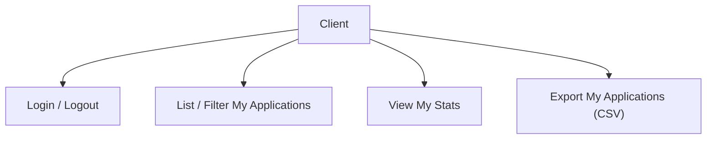

## System Flow

```mermaid
graph LR;
  subgraph Client
    A["User Browser"]
    B["React App (Vite + TanStack Query)"]
  end
  subgraph "Server (Express)"
    C["Express App"]
    E["Session (express-session)"]
    D["Routes: /api/auth/*, /api/users, /api/applications, /api/stats, /api/clients, /api/applications/export"]
    F["Storage (Drizzle)"]
  end
  subgraph Database
    G["Neon Postgres (DATABASE_URL)"]
  end
  A --> B
  B -->|"fetch /api/* (credentials: include)"| C
  C --> E
  C --> D
  D --> F
  F --> G
  G --> F
  F --> D
  D --> C
  C -->|"JSON responses"| B
```

## Admin Use Cases

```mermaid
graph TD;
  Admin["Admin"];
  UC1["Login / Logout"];
  UC2["View Dashboard Stats"];
  UC3["List / Filter All Applications"];
  UC4["Create Application (specify employee)"];
  UC5["Update Any Application"];
  UC6["Delete Application"];
  UC7["Manage Users (create / update / disable)"];
  UC8["List Active Clients"];
  UC9["Export Applications (CSV)"];
  Admin --> UC1;
  Admin --> UC2;
  Admin --> UC3;
  Admin --> UC4;
  Admin --> UC5;
  Admin --> UC6;
  Admin --> UC7;
  Admin --> UC8;
  Admin --> UC9;
```

## Employee Use Cases

```mermaid
graph TD;
  Emp["Employee"];
  EU1["Login / Logout"];
  EU2["List / Filter My Applications"];
  EU3["Create Application (auto employeeId)"];
  EU4["Update My Application"];
  EU5["View My Stats"];
  EU6["List Active Clients"];
  EU7["Export My Applications (CSV)"];
  Emp --> EU1;
  Emp --> EU2;
  Emp --> EU3;
  Emp --> EU4;
  Emp --> EU5;
  Emp --> EU6;
  Emp --> EU7;
```

## Client Use Cases

```mermaid
graph TD;
  Cli["Client"];
  CU1["Login / Logout"];
  CU2["List / Filter My Applications"];
  CU3["View My Stats"];
  CU4["Export My Applications (CSV)"];
  Cli --> CU1;
  Cli --> CU2;
  Cli --> CU3;
  Cli --> CU4;
```

